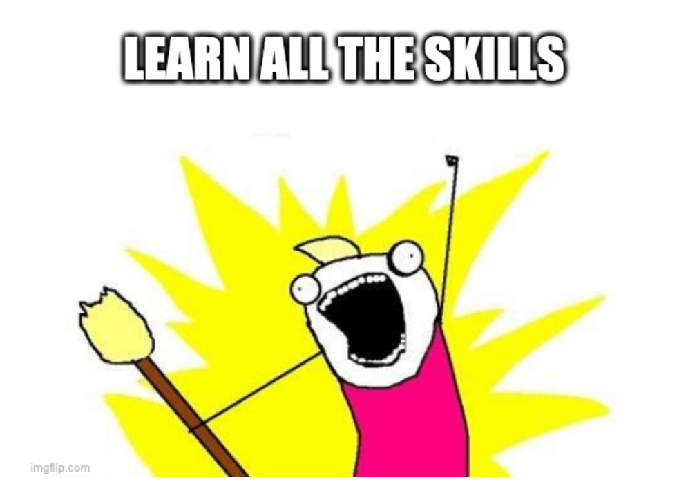

# The Core Skills of a Successful Developer

> **[TL;DR](https://en.wikipedia.org/wiki/Wikipedia:Too_long;_didn%27t_read)**
>
> 1. The ability to **understand the problem**.
> 2. The ability to **solve the problem**.

As with many professions, **a developer needs to know many skills** to be successful. You don't have to know it _all_, but **the more you know, the better you will be at your craft**, be it coding, composing music, designing buildings, or brewing beer. 🍺

A comprehensive list of _all the skills_ does not exist since there is an endless supply of problems to solve in totally different domains.

Still, **some of the skills are universally useful to all developers**, no matter the problem, the domain, or the technology involved.

These skills, once learned and honed, will stay with you for the rest of your life. Investing in learning them is worth the time and effort:

- **Become better in your profession.** A developer is an artisan ([10,000 hours to mastery](<https://en.wikipedia.org/wiki/Outliers_(book)>))! 💪
- **Get more satisfaction out of your job.** Take pride in what you do! 👩🏽‍🎨
- **Make better decisions.** Spend time on things that make the most sense. ☝️
- **Increase your job market value.** Skilled professionals are rare and sought after. 💰

> The greats weren't great because at birth they could paint
>
> The greats were great because they'd paint a lot
>
> **- Macklemore & Ryan Lewis**, _Ten Thousand Hours_

## 1. The ability to understand the "problem" 🤔

Understanding a problem is the key to its successful solution.

A "problem" is a complex word with many meanings. A problem is not always a negative thing. You could provide a _better solution_ for a problem that has already been solved, generating even more value than before.

> **It's the year 2007**. The mobile phone has solved the need to communicate by calling or texting on-the-go. Problem solved? Yes! Is there a way to generate even more value by doing things better?

🍎: Hold my [iPhone](https://en.wikipedia.org/wiki/IPhone)!

**cries in Nokian** 😭

### What is the problem?

Let's consider a concrete example from the financial domain.

It takes our salespeople a full week of manual work each month to copy & paste sales data into our ancient and complex ERP system. We need those people to **focus on sales and closing deals**, but _they don't have time_! Can we help them out? 🕘 = 💰

### Who is the problem affecting?

The salespeople are frustrated. They want to sell our product, thus generating more money for the company and increasing their income, since they get a slice of the profits as part of their salary.

The customers desperately want to buy our product. It is the best in the industry and solves all of their problems! But reserving a meeting with our busy salespeople takes way too long. So much so that some of the customers are giving up and finding another vendor. 😞

> Understanding the problem and who it affects helps in designing a better solution.

### What value does solving the problem produce?

Freeing the salespeople to sell stuff would mean more money for the company and them. The salespeople would be more satisfied, and thus more energetic and efficient! It would help us get more customers. So even more money! 🤑

> 🎶 its all about the dum dum duh dee dum dum 🎶 _**- Meja**, All About The Money_

### Is the problem worth solving?

Our calculations show we are losing truckloads of dough (💸) each month. Solving this problem is worth it! It beats going bankrupt due to frustrated salespeople and customers jumping ship. 🤷‍♀️

Not all problems are worth solving (unless you ask the consultants selling their services!). Do not be afraid of dismissing some problems. Focus on the ones that matter! You have limited time, so use it wisely.

> "Smart entrepreneurs don't try to fight every fire. Instead, they figure out which fires they can let burn — so they can focus on the ones they absolutely have to fight." **- Reid Hoffman**, [_Why the best entrepreneurs let fires burn_](https://www.linkedin.com/pulse/why-best-entrepreneurs-let-fires-burn-reid-hoffman)

## 2. The ability to solve the problem 💡

After understanding the problem and agreeing that solving it is worth the effort, it is time to come up with some possible solutions.

### The ability to think outside the box

**Step 1: Start coding?!** ⌨️

Hold your [Equus ferus caballus](https://en.wikipedia.org/wiki/Horse)! 🐴

Sure, one can always build solutions for problems, but what if you could **remove the problem** altogether? Then you would not need to spend time building a solution at all! Save time, coffee, and CPU cycles!

In this financial example, maybe the old ERP system and the whole process of entering data into it is the root of all evil. One option is to outsource that entire process to a CPTiERPaaS provider (Copy-Paste Things into ERP as a Service). That would free the organization from the whole process and let the salespeople focus 100% on [bringing home the bacon](https://dictionary.cambridge.org/dictionary/english/bring-home-the-bacon) (💵)!

**Before jumping to action, stop and think.** You might save a ton of time and money!

> For the sake of continuing this article, let's assume the CPTiERPaaS provider asks for too much money to be feasible, so implementing another solution is the better approach!

### The ability to leverage existing solutions

Avoid the [not invented here syndrome](https://en.wikipedia.org/wiki/Not_invented_here). The thing is, if you build it, **you have to maintain it**. All of it. Even the annoying little things. And make sure it works with IE6!

Always be on the lookout for **existing solutions** to problems.

If you need to start a fire, instead of buying seed, watering it, waiting for the tree to grow, mining for ore using your bare hands to forge an axe to chop a tree down with, figuring out how on earth does one manufacture a match, maybe just borrow some logs and matches from that friendly neighbor of yours!

> **The end goal is the fire, not the process of creating it.** (Unless you sell consultancy services!). 😇

For real, _there is no shame in using existing things_ instead of building your own! Many a great developer is as lazy as a sloth when it comes to choosing between coding everything or combining existing pieces to build the solution. **Be lazy, and be proud of it!**

### The ability to keep the solution as simple as possible

**Option A): Refactor the old ERP system** so that it takes less time to enter the data. Risk breaking functionality. And remember, you need to maintain your hacks! Good luck! 🤞

**Option B): Automate the current process.** Do not touch the ERP system. It kind of works, so it's better to leave it that way. Implementing automation on top of that sounds less risky and in the end it will still free the salespeople to make sales.

> If you find you need to code something, strive for laziness. Meaning, **write as little code as possible**. You know, _the least amount of bugs is found in code that has not been written at all_!

Laziness does not mean skipping best practices when writing the little code you are going to write. Your hack, using the ERP provider's vendor-specific code, might look like a turd, but at least it is a tiny and polished turd! 💩

### The ability to communicate the solution

Naming things well is important. _Yo, [**X Æ A-Xii**](https://www.theguardian.com/technology/2020/may/25/elon-musk-grimes-change-baby-name-roman-numerals-look-better), whaddap?_

The code you write, the comments you add to it, the external documentation you compose; all should be written in a clear, unambiguous manner. Your code is not write-only (Hi, [Perl](https://www.perl.org/)!).

> Most of the time will be spent reading code written by you and by other developers. **Learn to communicate fluently in code and writing!**

### The ability to prove the solution

Now that your beautiful creation compiles, it is time to deploy it to production, right? Wrong. **You say it works? Prove it!**

In the modern era, **testing** is one of the core skills of any self-respecting developer. Unit tests, integration tests, end-to-end tests; get familiar with all of those.

Making changes to a system that has excellent test coverage takes out a lot of unnecessary stress. How do I know if I break something? Oh well, it's just code for an airplane. 🤷🏻

> You deploy your ERP automation, and it runs on schedule. Great! It's doing things. But how do you know it's doing the _right_ things?

### The ability to adapt the solution when the problem changes

No software is perfect or final (other than maybe [Windows Me](https://en.wikipedia.org/wiki/Windows_Me)). New requirements come up. Some nasty bugs are found and squashed. Changes in the process require some parts of the code to be removed or rearranged.

If the requirements and the code are well-written by another craftsman, the system has good test coverage, and there is a test environment with proper CI practices, great!

> A big part of being a developer means reshaping and repurposing pieces of software, or even the entire software! Embrace change.

## More specific skills to acquire

We introduced some universally useful developer skills on a higher level. Some _specific_ things you need to know are:

- a programming language
- how to use version control
- how to deploy and run software
- **how to Google stuff** (this is the most important one!)

All this might seem daunting but fret not. **Learning skills, any skills, takes time.** Invest in learning generic programming skills, preferably more than one programming language, and general software development best practices. Also, **remember to have fun while learning!**

> Languages and tech stacks change. The core skills remain valid far longer than those!

## I'm specifically interested in learning automation. Where and how do I start?

Invest time in learning to use [a developer-focused automation stack that builds on top of popular open-source technologies](https://robocorp.com/).

- You will learn generic software development skills.
- You will learn popular and relevant technologies.
- You will learn to communicate the intent of your code.
- The skills you learn can be applied in all software development, not just automation!
- Skilled automation professionals are in great demand.

Whatever your profession, good luck on your journey! 🤖
